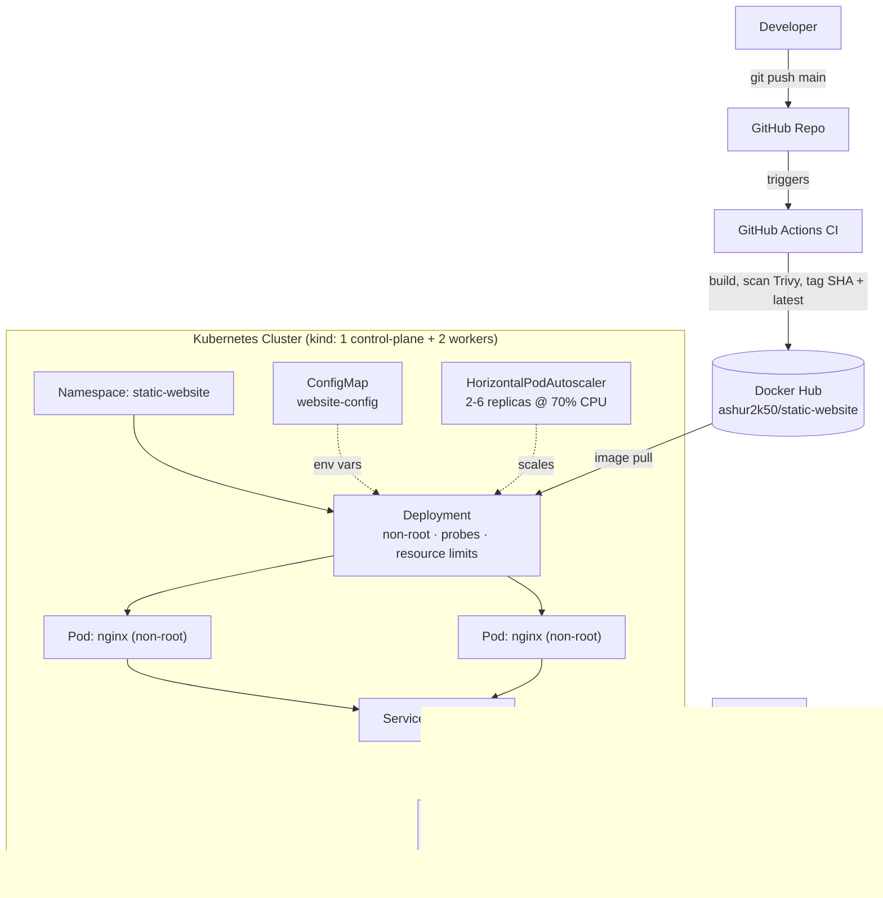

# Static Site on Kubernetes — CI/CD + Ingress + Autoscaling

A static website deployed on Kubernetes with a full local dev workflow: a hardened, non-root Nginx image, an automated build/scan/push pipeline via GitHub Actions, and ingress-routed, autoscaling traffic on a local `kind` cluster.


> **Project status: Closed at Stage 4 (partial) — 19 / 34 practices complete (~56%).**
> This project was built in deliberate stages and intentionally stopped once it demonstrated core + production-adjacent Kubernetes practices. See [Project Maturity Roadmap](#project-maturity-roadmap) for exactly what's done vs. deferred, and why.

---

## Architecture



**Flow:** a push to `main` triggers GitHub Actions, which builds the Nginx image, scans it with Trivy, and pushes it to Docker Hub tagged with both the git SHA and `latest`. Kubernetes pulls that image into a Deployment running as a non-root user, sitting behind a Service that ingress-nginx exposes at `static-website.local`. A HorizontalPodAutoscaler scales pods 2→6 under CPU load. Health is enforced via readiness/liveness probes, and runtime config is injected through a ConfigMap rather than baked into the image.

---

## Tech Stack

| Layer | Tool |
|---|---|
| Web server | Nginx, non-root (`nginxinc/nginx-unprivileged:1.27-alpine`) |
| Container | Docker |
| Orchestration | Kubernetes |
| Local cluster | kind (1 control-plane, 2 workers) |
| Ingress | ingress-nginx |
| Autoscaling | HorizontalPodAutoscaler (requires metrics-server) |
| CI/CD | GitHub Actions → Trivy scan → Docker Hub |
| Config | Kubernetes ConfigMap |

---

## Repository Structure

```
.
├── Dockerfile                          # non-root nginx-unprivileged image, port 8080
├── index.html                          # site content
├── kind/
│   └── kind-config.yaml                # local cluster topology (1 CP + 2 workers)
├── kubernetes/
│   ├── namespace.yaml                  # static-website namespace
│   ├── deployment.yaml                 # non-root, probes, resource limits, env from ConfigMap
│   ├── service.yaml                    # NodePort service -> pod port 8080
│   ├── config/
│   │   └── configmap.yaml              # APP_NAME / ENVIRONMENT / OWNER
│   ├── autoscaling/
│   │   └── hpa.yaml                    # HPA: 2-6 replicas @ 70% CPU
│   ├── ingress/
│   │   └── ingress.yaml                # routes static-website.local -> service
│   └── ingress-nginx/
│       └── deploy.yaml                 # ingress-nginx controller manifest
└── .github/workflows/
    └── docker-build.yaml               # build -> Trivy scan -> push (SHA + latest tags)
```

---

## Prerequisites

- [Docker](https://docs.docker.com/get-docker/)
- [kind](https://kind.sigs.k8s.io/)
- [kubectl](https://kubernetes.io/docs/tasks/tools/)
- [metrics-server](https://github.com/kubernetes-sigs/metrics-server) (only required if you want the HPA to actually scale — see step 6)

---

## Step-by-Step Walkthrough (practical, local)

### 1. Create the cluster
```bash
kind create cluster --config kind/kind-config.yaml
kubectl get nodes
```
📸 **Screenshot here:** `kubectl get nodes` showing 1 control-plane + 2 worker nodes in `Ready` state.

### 2. Install the ingress controller
```bash
kubectl apply -f kubernetes/ingress-nginx/deploy.yaml
kubectl wait --namespace ingress-nginx \
  --for=condition=ready pod \
  --selector=app.kubernetes.io/component=controller \
  --timeout=90s
```
📸 **Screenshot here:** `kubectl get pods -n ingress-nginx` showing the controller pod `Running`.

### 3. Deploy the app
```bash
kubectl apply -f kubernetes/namespace.yaml
kubectl apply -f kubernetes/config/configmap.yaml
kubectl apply -f kubernetes/deployment.yaml
kubectl apply -f kubernetes/service.yaml
kubectl apply -f kubernetes/ingress/ingress.yaml
kubectl apply -f kubernetes/autoscaling/hpa.yaml
```
📸 **Screenshot here:** `kubectl get all -n static-website` showing pods, service, and deployment all healthy.

### 4. Confirm the container is running as non-root
```bash
kubectl exec -n static-website deploy/static-website -- whoami
```
Expected output: `nginx` (not `root`).
📸 **Screenshot here:** terminal output of the command above — this is a good one to point to directly in an interview.

### 5. Point your hosts file at the ingress and verify
```bash
echo "127.0.0.1 static-website.local" | sudo tee -a /etc/hosts
curl http://static-website.local
```
📸 **Screenshot here:** browser open at `http://static-website.local` showing the site rendered.

### 6. (Optional) Confirm autoscaling is wired up
```bash
kubectl get hpa -n static-website
```
Expected: `TARGETS` shows a live CPU percentage instead of `<unknown>` (requires metrics-server installed on the cluster).
📸 **Screenshot here:** `kubectl get hpa -n static-website` output.

### 7. Verify the CI pipeline
Push a commit to `main` and open the **Actions** tab on GitHub.
📸 **Screenshot here:** the workflow run showing all three stages green — build, Trivy scan, push.
📸 **Screenshot here:** Docker Hub repo page (`ashur2k50/static-website`) showing both a SHA tag (e.g. `a1b2c3d`) and `latest` present after the run.

---

## CI/CD

`.github/workflows/docker-build.yaml`:
1. Builds the image
2. Scans it with **Trivy** for `CRITICAL`/`HIGH` CVEs (currently non-blocking — `exit-code: '0'` — so it reports without failing the build)
3. Pushes to Docker Hub tagged with both the short git SHA and `latest`

This means every build is now traceable back to an exact commit, and rollbacks are possible by deploying a previous SHA tag instead of whatever `latest` currently points to.

---

## Design Decisions

- **ConfigMap over hardcoded env values** — `APP_NAME` and `ENVIRONMENT` are injected at runtime so the same image can be reused across environments without rebuilding.
- **Readiness + liveness probes** — ensures Kubernetes only routes traffic to pods that are actually serving, and restarts pods that hang.
- **Explicit resource requests/limits** — keeps the scheduler honest and prevents one pod from starving its neighbors on a shared node.
- **Non-root container (`nginx-unprivileged`, port 8080)** — the container has no reason to run as root, so it doesn't. `securityContext` also drops all Linux capabilities and disables privilege escalation.
- **SHA + `latest` tagging** — `latest` stays convenient for local testing, but the SHA tag is what a real rollout/rollback would target.
- **HPA at 70% CPU, 2–6 replicas** — a conservative scaling band appropriate for a low-compute static site; the floor of 2 keeps the app available during a rolling update even before scaling kicks in.
- **NodePort for now, Ingress on top** — used directly under the hood for simplicity in a local `kind` cluster; ingress-nginx handles host-based routing so the setup mirrors how a real cluster would expose the app via a LoadBalancer + Ingress.

---

## Project Maturity Roadmap

**Overall progress: 19 / 34 practices complete (~56%) — closed after Stage 4 (partial)**

### Stage 1 — Containerization Basics ✅ Complete
- ✅ Dockerfile builds a working Nginx image
- ✅ Static site served correctly
- ✅ `.dockerignore` configured to keep image lean
- ✅ Image built and pushed to Docker Hub

### Stage 2 — Core Kubernetes Deployment ✅ Complete
- ✅ Dedicated `Namespace` (`static-website`)
- ✅ `Deployment` with multiple replicas
- ✅ CPU/memory `requests` and `limits` set
- ✅ Readiness probe configured
- ✅ Liveness probe configured
- ✅ `Service` (NodePort) routing to pods
- ✅ `ConfigMap` for runtime configuration (no hardcoded env values)
- ✅ Local multi-node cluster via `kind` (1 control-plane + 2 workers)
- ✅ Ingress + ingress-nginx controller routing by hostname

### Stage 3 — CI/CD Automation ✅ Complete (for this project's scope)
- ✅ GitHub Actions pipeline builds and pushes image on `main`
- ✅ Docker Hub authentication via GitHub Secrets
- ✅ Images tagged with git SHA, not just `:latest`
- ✅ Image vulnerability scanning (Trivy) added to CI
- ⬜ *Deferred:* automated deploy step (CD) — deploy is intentionally kept manual (`kubectl apply`) so the cluster state stays predictable for a portfolio/demo project
- ⬜ *Deferred:* manifest lint/validate step (`kubeconform`)

### Stage 4 — Production Hardening 🔶 Partial (closed here)
- ✅ `HorizontalPodAutoscaler` added (2–6 replicas, 70% CPU target)
- ✅ Container runs as non-root, capabilities dropped, privilege escalation disabled
- ⬜ *Deferred:* `PodDisruptionBudget`
- ⬜ *Deferred:* `NetworkPolicy`
- ⬜ *Deferred:* dedicated `ServiceAccount` + RBAC
- ⬜ *Deferred:* `Secret`-based config (nothing sensitive to protect yet, so a ConfigMap is honestly sufficient here)
- ⬜ *Deferred:* TLS via `cert-manager`

### Stage 5 — Multi-Environment / GitOps ⬜ Out of scope for this project
- ⬜ Kustomize overlays for dev/staging/prod
- ⬜ ingress-nginx via Helm chart instead of a vendored manifest
- ⬜ GitOps (ArgoCD/Flux)

### Stage 6 — Observability & Operations ⬜ Out of scope for this project
- ⬜ Prometheus/Grafana
- ⬜ Centralized logging
- ⬜ Written runbook
- ⬜ Load testing results

---

> **Why it stops here:** Stages 1–4 cover the practices most commonly probed in interviews — deployment fundamentals, health checks, CI with image scanning and traceable tags, autoscaling, and container security. Stages 5–6 (GitOps, full observability stack) are real production concerns but require infrastructure (a managed cluster, a metrics stack) beyond what a local `kind` demo can meaningfully show. They're listed here as known next steps, not omissions.

---

## Author

**Ashutosh Rai**
